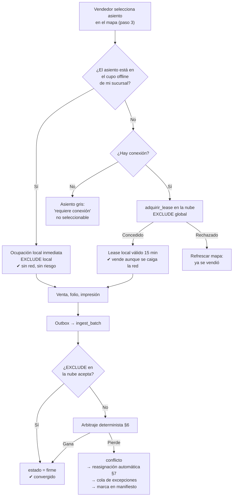

# 01b — Consistencia de Asientos entre Sucursales

> Blueprint v0.2. Este es el problema central del sistema.
> Actualizado con el mapa real de 18 plazas (`knowledge/esquema.JPG`, delta D-6).

---

## 1. Enunciado

Una salida sale de S1 y para en S2 y S3 antes de llegar a S4. La unidad tiene 18 asientos.
S1, S2 y S3 pueden vender asientos de esa misma salida. Si S1 y S2 están desconectadas
entre sí, ambas pueden vender el asiento 7 del mismo viaje.

El requerimiento lo dice explícitamente: *"los asientos de la sucursal origen también
pueden ser vistos por la sucursal intermedia y no deben traslaparse o venderse dos veces"*.

Y hay un agravante que descarta la solución obvia: **un asiento no es un contador**. El
cliente **elige un asiento específico en un mapa**. No basta con repartir "3 lugares"; hay
que repartir **identidades de asiento**.

---

## 2. Modelo de ocupación por tramo

Una salida con paradas `P0..Pn` define `n` tramos. Un boleto de `Pi` a `Pj` ocupa el asiento
en el rango `[i, j)`. Dos boletos pueden compartir asiento si sus rangos no se solapan
(alguien baja en P2 y otro sube en P2 al mismo asiento).

En la nube, el invariante se garantiza con una **restricción de exclusión** de PostgreSQL:

```sql
CREATE EXTENSION IF NOT EXISTS btree_gist;

CREATE TABLE core.asiento_ocupacion (
  id           uuid PRIMARY KEY,
  salida_id    uuid NOT NULL REFERENCES core.salida(id),
  asiento_num  smallint NOT NULL,
  tramos       int4range NOT NULL,   -- [orden_parada_origen, orden_parada_destino)
  boleto_id    uuid NOT NULL,
  estado       text NOT NULL,        -- 'firme' | 'conflicto' | 'liberado'
  sucursal_id  uuid NOT NULL,
  emitido_en   timestamptz NOT NULL,
  prioridad    integer NOT NULL,     -- calculada, §5
  EXCLUDE USING gist (
    salida_id   WITH =,
    asiento_num WITH =,
    tramos      WITH &&
  ) WHERE (estado = 'firme')
);
```

Esta constraint es la **última línea de defensa y es absoluta**: la base de datos
físicamente no puede aceptar dos ocupaciones firmes solapadas. La misma tabla y la misma
constraint existen en el nodo local.

**Confirmado en v0.2 (P6)**: el proyecto de Supabase es del proveedor, así que `btree_gist`
se puede habilitar. La garantía dura es viable, no un supuesto.

---

## 3. Mecanismo 1 — Cupo offline particionado (evita el conflicto)

### 3.1 El mapa real: Sprinter de 18 plazas

Fuente: `knowledge/esquema.JPG`. Configuración **1+2**, acceso al frente.

```
                 FRENTE
   ┌──────┬──────┐  ║  ┌──────┐
   │  18  │      │  ║  │   1  │      ← acceso
   ├──────┼──────┤  ║  ├──────┤
   │   2  │   3  │  ║  │   4  │
   ├──────┼──────┤  ║  ├──────┤
   │   5  │   6  │  ║  │   7  │
   ├──────┼──────┤  ║  ├──────┤
   │   8  │   9  │  ║  │  10  │
   ├──────┼──────┤  ║  ├──────┤
   │  11  │  12  │  ║  │  13  │
   ├──────┼──────┼──╨──┼──────┤
   │  14  │  15  │  16 │  17  │      ← banca trasera de 4
   └──────┴──────┴─────┴──────┘
     ventana  pasillo      pasillo/ventana
```

- Singles: **1, 4, 7, 10, 13**
- Pares: **(2,3), (5,6), (8,9), (11,12)** — el par es ventana + pasillo
- Banca trasera de 4: **14, 15, 16, 17**
- **18** al frente, junto al acceso

El layout se declara como dato (`tipo_unidad.mapa`, ver
[02-modelo-datos.md §3](02-modelo-datos.md)) y esta Sprinter se siembra como primera
plantilla. Nada del código conoce el número 18.

### 3.2 Reparto por bloques contiguos, no por asientos sueltos

Al materializar una salida, el job nocturno reparte el mapa entre las paradas que venden.
**Regla nueva en v0.2**, derivada de la geometría real:

> **Se reparten bloques contiguos completos —filas o banca—, nunca asientos sueltos de
> filas distintas.**

Razón operativa: si a una sucursal intermedia se le asignaran, por ejemplo, los asientos
{3, 9, 16}, una pareja que compra dos boletos ahí quedaría **separada en filas distintas**
aunque la unidad vaya casi vacía. El cliente lo percibiría como un defecto del sistema y no
tendría forma de entender por qué. Repartir por bloques lo hace imposible.

Bloques naturales de esta Sprinter:

| Bloque | Asientos | Capacidad de grupo |
|---|---|---|
| B0 · frente | 18, 1 | 2 (separados por el pasillo) |
| B1 · fila 1 | 2, 3, 4 | 3 — pareja junta + 1 |
| B2 · fila 2 | 5, 6, 7 | 3 |
| B3 · fila 3 | 8, 9, 10 | 3 |
| B4 · fila 4 | 11, 12, 13 | 3 |
| B5 · banca trasera | 14, 15, 16, 17 | 4 juntos |

### 3.3 Reparto por defecto, ruta S1 → S2 → S3 → S4

```sql
CREATE TABLE core.cupo_offline (
  id            uuid PRIMARY KEY,
  salida_id     uuid NOT NULL,
  sucursal_id   uuid NOT NULL,       -- quién puede vender esto sin red
  asientos      smallint[] NOT NULL, -- identidades concretas, no un contador
  bloques       text[] NOT NULL,     -- trazabilidad del reparto
  tramos        int4range NOT NULL,  -- desde qué parada puede vender
  vigente_desde timestamptz NOT NULL,
  vigente_hasta timestamptz NOT NULL,-- devolución automática (SUPUESTO S5: T−4 h)
  UNIQUE (salida_id, sucursal_id)
);
```

| Sucursal | Bloques | Asientos | Total | Tramos |
|---|---|---|---|---|
| **S1** (origen) | B0, B1, B2, B5 | 18, 1, 2, 3, 4, 5, 6, 7, 14, 15, 16, 17 | **12** | `[0,3)` |
| **S2** (intermedia) | B3 | 8, 9, 10 | **3** | `[1,3)` |
| **S3** (intermedia) | B4 | 11, 12, 13 | **3** | `[2,3)` |
| S4 (destino final) | — | — | 0 | no vende |

Propiedades del reparto:

- **Cada sucursal intermedia posee una fila completa**: pareja junta más un tercero al otro
  lado del pasillo. Un grupo de hasta 3 nunca queda separado dentro de su propio cupo.
- **S1 se queda con la banca trasera**, que es el único bloque de 4: los grupos familiares
  compran mayoritariamente en el origen.
- Los conjuntos son **disjuntos**: `12 + 3 + 3 = 18`, sin traslape.

### 3.4 La regla de oro de la operación offline

> Sin conexión, una sucursal solo puede vender asientos de su propio cupo.
> Los demás aparecen en gris con la leyenda *"requiere conexión"* y no son seleccionables.

Consecuencia: **cero sobreventa por construcción mientras se está offline.** No es
"probablemente cero": es imposible, porque los conjuntos son disjuntos y ninguna sucursal
puede tocar el de otra sin pedir permiso.

Esto además cumple la promesa comercial de la lámina 7 de la propuesta ("el asiento se
aparta al instante, sin confirmación en línea") de forma honesta y acotada.

### 3.5 Rutas con más o menos paradas

El algoritmo asigna bloques enteros ponderados por demanda histórica (v1: proporción
configurable por parada; v2: media móvil de ocupación por parada).

- **2 paradas** (sin intermedias): S1 se queda con los 6 bloques.
- **5–6 paradas vendedoras**: hay exactamente 6 bloques, así que todavía alcanza uno por
  parada — pero el origen queda con uno solo, lo cual es operativamente absurdo. A partir
  de 5 paradas el reparto por bloques deja de ser suficiente y hay que **degradar a reparto
  por fila partida** o depender más del lease en línea (§4). Límite documentado; con las
  4 sucursales actuales no se alcanza.

---

## 4. Mecanismo 2 — Devolución de cupo por expiración de reloj, sin mensajes

Problema: si S2 tiene la fila 3 apartada y no la vende, esos 3 asientos se desperdician en
una unidad con demanda desde S1.

Solución: `cupo_offline.vigente_hasta` (**SUPUESTO S5: T−4 h** del paso por esa parada).
Al vencer:

- La sucursal dueña, **aunque esté offline**, deja de poder vender esos asientos: es una
  condición local sobre su propio reloj, no requiere red.
- La nube los reabre al pool general.

**Ambos lados llegan a la misma conclusión sin comunicarse, porque la expiración es una
función del tiempo, no de un mensaje.** Es el mismo mecanismo que un lease de DHCP.

Condición de seguridad — relojes sincronizados. Mitigaciones:

- **NTP activo es parte del instalador** (D-5), no una recomendación.
- **Zona muerta de 15 min**: la sucursal dueña deja de vender en `vigente_hasta − 15 min`;
  la nube reabre en `vigente_hasta + 15 min`. Ninguna deriva menor a 15 min puede producir
  doble venta.
- Deriva > 2 min: alerta. Deriva > 5 min: modo degradado, se exige conexión para vender
  cerca de la frontera de expiración.

---

## 5. Mecanismo 3 — Lease en línea

Con conexión, una sucursal puede vender **cualquier** asiento libre, incluidos los del cupo
de otra. Para hacerlo pide un lease:

```
POST api.rpc/adquirir_lease
  { salida_id, asiento_num, tramos, sucursal_id, duracion_seg: 900 }
```

La RPC inserta en `core.asiento_lease` con la **misma constraint de exclusión** contra las
ocupaciones firmes y contra otros leases vivos, en una sola transacción. Si el insert falla,
el asiento ya está tomado y la UI refresca el mapa.

- Dura 15 min (**SUPUESTO**), suficiente para los pasos 3→6 con holgura.
- **Si se cae el internet después de conceder el lease, la venta se completa igual**: el
  nodo lo tiene guardado localmente y es válido hasta expirar. El boleto se emite, se
  imprime y sube al reconectar.
- Un lease no consumido expira solo. No hace falta liberarlo (el nodo lo intenta al cancelar
  el flujo, como optimización).
- Un lease es **reserva de capacidad, no una venta**: no genera folio ni movimiento de caja.

---

## 6. Mecanismo 4 — Reconciliación cuando el conflicto ocurre igual

A pesar de todo lo anterior, un conflicto puede ocurrir por: deriva de reloj superior a la
zona muerta, autorización manual de un gerente que fuerza un asiento fuera de cupo, un bug,
la restauración de un respaldo, o un cambio de unidad con mapa incompatible
([02 §5](02-modelo-datos.md)).

**Detección**: en `ingest_batch`, la constraint de exclusión rechaza la segunda ocupación.
La RPC captura la excepción y, en vez de fallar el lote, marca la ocupación entrante como
`estado='conflicto'` y devuelve un ACK de tipo `conflicto`.

**Arbitraje — determinista y reproducible en ambos lados** (SUPUESTO S2). Gana la
`prioridad` mayor:

| Nivel | Criterio | Racional |
|---|---|---|
| 1 | Boleto **pagado y ya impreso** | El pasajero tiene un papel en la mano; es lo más difícil de revertir |
| 2 | Boleto **pagado**, no impreso | Ya hubo dinero |
| 3 | Boleto con **abono parcial** | Hay compromiso económico |
| 4 | Reservación sin pago | Nada comprometido |
| Desempate A | `emitido_en` más antiguo | Quien vendió primero en tiempo real |
| Desempate B | `sucursal_id`, luego `boleto_id` | Determinista, arbitrario pero estable |

**Explícitamente NO se usa el orden de llegada a la nube.** Eso premiaría a la sucursal con
mejor internet y castigaría a la que el sistema promete proteger; además no sería
reproducible.

Ambos nodos calculan la misma prioridad con los mismos datos y llegan al mismo ganador. La
nube lo materializa, pero no lo decide.

**El perdedor nunca se borra.** Pasa a `estado='conflicto'`, el boleto queda
`conflicto_sobreventa` y entra en la cola de excepciones.

---

## 7. El caso duro: el boleto perdedor ya se imprimió

Es el escenario que va a ocurrir en producción y el que define la percepción del cliente
sobre el sistema.

**Decisión de diseño habilitante: el folio identifica la venta, no el asiento.** Un boleto
puede cambiar de asiento conservando folio, importe y QR base. Eso convierte un problema
irreversible en uno reversible.

Secuencia de resolución, en orden:

1. **Reasignación automática** (SUPUESTO S3). Si hay un asiento libre en la misma salida y
   mismos tramos, se reasigna de inmediato. **Preferencia de reasignación, en orden**:
   (a) otro asiento del mismo bloque; (b) un asiento adyacente al de los acompañantes de la
   misma venta; (c) cualquiera libre. Se registra
   `nota_auditoria(tipo='reasignacion_por_conflicto')` y se encola una **reimpresión
   marcada** `REIMPRESIÓN — CAMBIO DE ASIENTO` con el mismo folio. Se genera alerta en la
   caja que emitió el boleto para llamar al pasajero — por eso el **SUPUESTO S11** hace
   obligatorio un teléfono de contacto por venta.
   En la práctica esta rama cubre la gran mayoría de los casos: es raro que el conflicto
   coincida con la unidad al 100%.
2. **Cola de excepción con atención humana.** Si la unidad va llena, severidad alta.
   Acciones para el gerente: mover a otra salida del mismo día, cancelar con devolución
   (S1), o escalar.
3. **Última línea de defensa: el manifiesto de abordaje.** La lista que se imprime al
   momento de la salida se genera con los datos más recientes disponibles y marca en
   negritas cualquier boleto en conflicto no resuelto y cualquier asiento con dos folios.
   El operador ve el problema con el pasajero enfrente, no en el reporte del mes.

---

## 8. Por qué no CRDT para asientos

Un CRDT garantiza que todas las réplicas converjan al mismo estado. **No garantiza que ese
estado sea válido.** Un OR-Set de ocupaciones convergería felizmente a
`{asiento7→Juan, asiento7→María}` en todas las réplicas. La convergencia no es el problema;
la invariante lo es. Por eso el diseño usa CRDT donde la invariante es monótona (pagos,
abordajes: clase C) y particionamiento de capacidad donde no lo es.

---

## 9. Flujo completo



---

## 10. Pruebas de aceptación

| Escenario | Resultado esperado |
|---|---|
| S1 y S2 offline venden simultáneamente dentro de sus cupos | Imposible que colisionen (conjuntos disjuntos). Verificar que la UI lo impide y que la BD lo confirmaría |
| S1 offline; S2 online fuerza un asiento del cupo de S1 con override de gerente | Conflicto detectado; **ambos nodos calculan el mismo ganador**; el perdedor se reasigna; reimpresión encolada; excepción visible en ambas cajas |
| Reloj de S2 adelantado 10 min | Zona muerta lo absorbe; sin doble venta |
| Reloj de S2 adelantado 45 min | Modo degradado activado; alerta; sin doble venta |
| Red cae entre el lease y la confirmación | La venta se completa igual |
| Pareja compra 2 boletos en S2 estando offline | Quedan **juntos** (fila completa en el cupo), no separados |
| Grupo de 4 compra en S1 | Caben en la banca trasera |
| Salida en estado `en_ruta` | No se puede vender ni reservar |
| Cupo de S2 vence a T−4 h sin vender | S2 deja de ofrecerlos offline; la nube los reabre; sin doble venta en la zona muerta |
