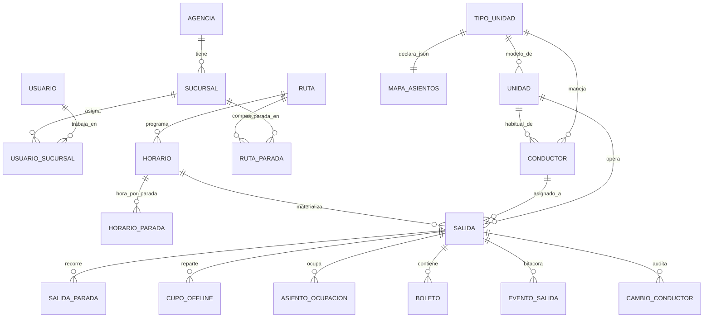

# 02 — Modelo de Dominio: Organización, Flota, Rutas y Salidas

> Blueprint v0.2. Esquema implementado en `src/db/migrations/`.
> Ventas, caja, folios y configuración: [02b-modelo-transaccional.md](02b-modelo-transaccional.md).
> Toda tabla del dominio lleva el bloque de auditoría/sync de
> [01-sincronizacion.md §2.3](01-sincronizacion.md) (omitido abajo por brevedad).

---

## 1. Esquemas de base de datos

| Esquema | Contenido | Local | Nube |
|---|---|---|---|
| `core` | Entidades del dominio | ✔ | ✔ |
| `sync` | outbox, cursores, lotes, excepciones, checksums, cambio_log | ✔ | ✔ |
| `auth_local` | credenciales replicadas, sesiones, intentos | ✔ | parcial |
| `api` | **vistas versionadas de solo lectura** para el sistema externo | ✖ | ✔ |
| `rpt` | vistas materializadas de reportes del dashboard | ✖ | ✔ |

El esquema `api` es el contrato con "el otro sistema fuera de alcance". **P7 quedó
parcialmente respondida**: es de **solo lectura, para visualizar reportes**. Falta el
mecanismo de acceso y los campos exactos, así que el esquema `api` se deja **andamiado y
versionado** (`api.v1_*`) pero no congelado. No bloquea `core`.

---

## 2. Mapa de entidades



---

## 3. Flota: tipo de unidad y mapa de asientos declarativo

Resuelve la **CONTRADICCIÓN C2** (Sprinter / Suburban / Urvan mencionadas
indistintamente) y el delta **D-6**: ningún layout se hardcodea.

```sql
core.tipo_unidad (
  id            uuid PK,
  clave         text UNIQUE,   -- 'SPRINTER-18'
  nombre        text,          -- 'Mercedes Benz Sprinter 18 plazas'
  marca text, modelo text,
  num_asientos  smallint,      -- derivado del mapa, validado por CHECK
  mapa          jsonb NOT NULL
)

core.unidad (
  id uuid PK,
  tipo_unidad_id uuid FK,
  numero_economico text,       -- se imprime en el ticket (paso 5)
  placas text,
  sucursal_base_id uuid FK
)
```

### 3.1 Formato del mapa (`tipo_unidad.mapa`)

Declarativo, versionado, renderizable sin código específico por modelo:

```jsonc
{
  "version": 1,
  "filas": 6,
  "columnas": 4,
  "pasillo_despues_columna": 1,   // el pasillo va entre col 1 y col 2
  "frente": "arriba",
  "accesos": [ { "fila": 0, "lado": "derecho", "etiqueta": "ACCESO" } ],
  "asientos": [
    { "num": 18, "fila": 0, "col": 0, "tipo": "normal", "vendible": true },
    { "num": 1,  "fila": 0, "col": 3, "tipo": "normal", "vendible": true },
    { "num": 2,  "fila": 1, "col": 0, "tipo": "ventana", "vendible": true },
    { "num": 3,  "fila": 1, "col": 1, "tipo": "pasillo", "vendible": true },
    { "num": 4,  "fila": 1, "col": 3, "tipo": "normal",  "vendible": true }
    // ... hasta 17
  ],
  "bloques": [
    { "clave": "B0", "etiqueta": "frente",         "asientos": [18, 1] },
    { "clave": "B1", "etiqueta": "fila 1",         "asientos": [2, 3, 4] },
    { "clave": "B2", "etiqueta": "fila 2",         "asientos": [5, 6, 7] },
    { "clave": "B3", "etiqueta": "fila 3",         "asientos": [8, 9, 10] },
    { "clave": "B4", "etiqueta": "fila 4",         "asientos": [11, 12, 13] },
    { "clave": "B5", "etiqueta": "banca trasera",  "asientos": [14, 15, 16, 17] }
  ]
}
```

`bloques` no es decorativo: es la unidad de reparto de cupos offline
([01b §3.2](01b-consistencia-asientos.md)). Un tipo de unidad sin bloques declarados no
puede participar en rutas con paradas intermedias.

La plantilla de la Sprinter de 18 se siembra en
`src/db/seed/0001_tipo_unidad_sprinter18.sql`.

---

## 4. Conductores (D-7)

**Confirmado (P11)**: *"el catálogo de conductores debe asociarse el tipo de unidad que
manejan y esquema a utilizar; cuando se seleccione un horario asociado al conductor o a la
unidad se mostrará el esquema asociado"*.

```sql
core.conductor (
  id uuid PK,
  nombre text NOT NULL,
  direccion text, telefono text,
  ine_numero text, ine_archivo_url text,
  contacto_nombre text, contacto_telefono text,   -- opcional, por el requerimiento
  -- D-7: cadena conductor → unidad → tipo_unidad → esquema
  unidad_habitual_id uuid FK REFERENCES core.unidad(id),
  tipo_unidad_id     uuid FK REFERENCES core.tipo_unidad(id) NOT NULL,
  CHECK (unidad_habitual_id IS NULL
         OR tipo_unidad_id = (SELECT tipo_unidad_id FROM core.unidad
                              WHERE id = unidad_habitual_id))  -- vía trigger
)
```

`tipo_unidad_id` es obligatorio y `unidad_habitual_id` opcional: un conductor puede tener un
tipo de unidad asignado sin tener una unidad concreta fija.

**Sobre la duda del requerimiento** (*"validar si el módulo de conductores puede vivir en
horarios o separarse"*): queda como **catálogo propio**, resuelto por D-7. Razón técnica:
el conductor es ahora el portador de la relación con el tipo de unidad y el esquema, y en
Etapa 2 será además quien lleva la paquetería. Acoplarlo a `horario` obligaría a
refactorizarlo dos veces. La UI puede seguir presentándolo dentro de la pantalla de
horarios; separar el dato no obliga a separar la pantalla.

---

## 5. La regla crítica: cambio de conductor sobre una salida con boletos vendidos

### 5.1 El problema que introduce D-7

El cambio de conductor es un evento **cotidiano** —enfermedad, cambio de turno,
reasignación de última hora— mucho más frecuente que el cambio de unidad. Si el mapa de
asientos se resolviera **en vivo** por la cadena `salida → conductor → unidad →
tipo_unidad → mapa`, entonces un simple relevo de conductor podría cambiar el mapa de una
salida que ya tiene boletos vendidos **en otras sucursales**, invalidando asientos que ya
están impresos en papel y que esas sucursales ni siquiera pueden consultar si están
offline.

### 5.2 Decisión: el mapa se congela por snapshot al materializar

```sql
core.salida (
  id uuid PK,
  horario_id uuid FK,
  fecha_operacion date NOT NULL,
  -- snapshot congelado: NO se resuelve en vivo por el conductor
  tipo_unidad_id  uuid FK NOT NULL,
  mapa_snapshot   jsonb NOT NULL,     -- copia del mapa vigente al materializar
  unidad_id       uuid FK,
  conductor_id    uuid FK,            -- mutable, operativo
  conductor_nombre_snapshot text,     -- para el manifiesto ya impreso
  estado text NOT NULL,               -- programada|en_ruta|finalizada|cancelada
  salida_real_en timestamptz,
  UNIQUE (horario_id, fecha_operacion)
)
```

**Cambiar el conductor NO cambia el mapa.** El mapa solo cambia por una operación explícita
y validada (§5.3). Esto desacopla el evento operativo diario del invariante de datos, y es
la corrección más importante que introduce D-7.

**Efecto secundario útil**: el conductor mostrado para una salida a 60 días es en la
práctica un marcador de planeación, no un compromiso. El sistema lo trata como tal y no
alerta por reasignaciones lejanas.

### 5.3 Regla de compatibilidad — el invariante correcto

La regla propuesta era "solo se permite cambiar a un conductor del **mismo tipo de unidad**".
Se adopta una regla **más precisa en ambos sentidos**, porque la igualdad de tipo no es el
invariante real:

> El invariante no es *mismo tipo de unidad*. Es:
> **`asientos_vendidos(salida) ⊆ asientos_vendibles(mapa_nuevo)`**
> y **`bloques_repartidos(salida) ⊆ bloques(mapa_nuevo)`**.

Es a la vez **más seguro** (dos unidades del mismo tipo podrían tener mapas distintos si el
catálogo se editó entre medias, y la igualdad de tipo no lo detectaría) y **menos
restrictiva** (permite la sustitución común hacia otro tipo cuyo mapa contiene los asientos
vendidos, que es segura y hoy sería bloqueada sin razón).

| Caso | Condición | Comportamiento |
|---|---|---|
| **1 — Compatible** | El nuevo tipo satisface el invariante (incluye el caso trivial de mismo tipo) | Cambio permitido a vendedor, gerente y administrador. Se registra `cambio_conductor`. **No** se toca el mapa ni los cupos. |
| **2 — Incompatible** | Algún asiento vendido o algún bloque repartido no existe en el mapa nuevo | **Bloqueado para vendedor.** Gerente o administrador pueden forzarlo; queda auditado y **cada boleto huérfano entra en la cola de reasignación**, reutilizando la maquinaria de [01b §7](01b-consistencia-asientos.md) — no se construye un flujo nuevo. |
| **3 — Sin boletos vendidos** | `COUNT(boleto) = 0` en la salida | Cambio libre. Se re-materializan `mapa_snapshot` y `cupo_offline`. |
| **4 — Salida `en_ruta` o `finalizada`** | — | Prohibido. El conductor queda como dato histórico. |

### 5.4 El caso 2 exige conexión

Un cambio de mapa **no puede aplicarse con seguridad estando offline**: otras sucursales
tienen cupos vigentes sobre asientos que podrían dejar de existir, y esta sucursal no puede
saber qué vendieron ni avisarles.

Por tanto:

- Caso 2 **requiere conexión**. Sin ella, el cambio se registra como `pendiente` y se aplica
  en la siguiente sincronización, previa revalidación.
- Al aplicarse, la nube **recalcula `cupo_offline`** para todas las paradas y propaga el
  nuevo reparto. Si algún cupo de otra sucursal se reduce, esa reducción viaja como dato con
  `effective_from` inmediato y esa sucursal deja de ofrecer esos asientos en cuanto lo
  recibe.
- Cualquier boleto que quede sin asiento genera excepción `mapa_incompatible` de severidad
  **crítica**.

```sql
core.cambio_conductor (       -- clase C: append-only, auditoría
  id uuid PK,
  salida_id uuid FK NOT NULL,
  conductor_anterior_id uuid, conductor_nuevo_id uuid NOT NULL,
  tipo_unidad_anterior_id uuid, tipo_unidad_nuevo_id uuid,
  caso smallint NOT NULL,             -- 1..4 según §5.3
  requirio_autorizacion boolean NOT NULL,
  autorizado_por uuid,
  boletos_afectados smallint NOT NULL DEFAULT 0,
  motivo text,
  aplicado_en timestamptz, estado text NOT NULL  -- aplicado | pendiente | rechazado
)
```

---

## 6. Rutas, horarios y salidas

Tres niveles, deliberadamente separados:

| Nivel | Entidad | Naturaleza | Quién lo crea |
|---|---|---|---|
| Plantilla geográfica | `ruta` + `ruta_parada` | qué sucursales toca y en qué orden | administrador |
| Plantilla temporal | `horario` + `horario_parada` | a qué hora, qué días, con qué conductor | administrador |
| **Instancia** | `salida` + `salida_parada` | **el viaje concreto del 14 de marzo a las 07:00** | job nocturno |

```sql
core.ruta (
  id uuid PK, nombre text,               -- 'CDMX → Huajuapan'
  sucursal_origen_id uuid FK, sucursal_destino_id uuid FK
)

core.ruta_parada (
  id uuid PK, ruta_id uuid FK, sucursal_id uuid FK,
  orden smallint NOT NULL,               -- 0 = origen ... n = destino
  peso_cupo numeric(5,4),                -- proporción sugerida para el reparto
  UNIQUE (ruta_id, orden), UNIQUE (ruta_id, sucursal_id)
)

core.horario (
  id uuid PK, ruta_id uuid FK,
  hora_salida time NOT NULL,             -- de la parada 0
  dias_semana smallint[] NOT NULL,       -- [1..7]
  conductor_id uuid FK,                  -- D-7: de aquí sale el tipo de unidad
  unidad_id uuid FK,                     -- opcional; puede diferirse a la salida
  vigente_desde date, vigente_hasta date,
  effective_from timestamptz NOT NULL    -- ventana de madrugada (03 §3)
)

core.horario_parada (
  id uuid PK, horario_id uuid FK, ruta_parada_id uuid FK,
  orden smallint, hora_paso time NOT NULL, minutos_offset integer
)

core.salida_parada (
  id uuid PK, salida_id uuid FK, sucursal_id uuid FK,
  orden smallint NOT NULL,               -- índice del tramo
  hora_paso_programada timestamptz NOT NULL,
  cierre_venta_en timestamptz NOT NULL,  -- SUPUESTO S4: hora_paso − 15 min
  UNIQUE (salida_id, orden)
)
```

**Tramo** = par de paradas consecutivas. Un boleto de la parada `i` a la `j` ocupa
`int4range(i, j)`. Con 4 paradas hay 3 tramos.

### 6.1 Materialización

Job nocturno en la nube que, para el horizonte de **90 días** (SUPUESTO S6), crea
`salida` + `salida_parada` + `cupo_offline` y las replica a todas las sucursales.

Sin esto, una sucursal offline no podría vender viajes futuros. Por eso el horizonte es
largo: cubre el peor corte de conexión plausible con margen amplio.

En cada salida materializada:
1. Se resuelve el conductor del horario → su `tipo_unidad_id` → su `mapa`.
2. Se **copia el mapa a `salida.mapa_snapshot`** (§5.2).
3. Se reparten los bloques en `cupo_offline` según `ruta_parada.peso_cupo`
   ([01b §3.3](01b-consistencia-asientos.md)).

`estado='en_ruta'` bloquea toda venta y reservación sobre esa salida, tal como pide el
requerimiento.

---

## 7. Organización y personas

```sql
core.agencia (id uuid PK, nombre text, rfc text)

core.sucursal (
  id uuid PK, agencia_id uuid FK,
  nombre text, direccion_completa text,   -- se imprime en el ticket
  telefono_principal text,                -- se imprime en el ticket
  codigo char(1) NOT NULL UNIQUE,         -- prefijo de folio, alfabeto base32 (02b §1)
  zona_horaria text NOT NULL DEFAULT 'America/Mexico_City',
  activa_desde date, effective_from timestamptz
)

core.usuario (
  id uuid PK, nombre text, email citext UNIQUE,
  rol text CHECK (rol IN ('administrador','gerente','vendedor')),
  sueldo numeric(12,2),                   -- req: reportes de gastos (VACÍO V4)
  effective_from timestamptz NOT NULL,    -- alta diferida (ventana de madrugada)
  effective_until timestamptz             -- baja diferida
)

core.usuario_sucursal (
  id uuid PK, usuario_id uuid FK, sucursal_id uuid FK,
  effective_from timestamptz, effective_until timestamptz,
  UNIQUE (usuario_id, sucursal_id)
)
-- "los usuarios solo podrán ingresar si tienen una sucursal activa"

core.rol_permiso (rol text, permiso text, PRIMARY KEY (rol, permiso))
-- matriz de permisos como DATO replicado, no como if en el código
```

---

## 8. Índices críticos (flota y salidas)

```sql
-- Búsqueda de horarios con disponibilidad (pasos 1 y 2 del flujo de venta)
CREATE INDEX ON core.salida (fecha_operacion, estado) WHERE activo;
CREATE INDEX ON core.salida_parada (sucursal_id, hora_paso_programada);
CREATE INDEX ON core.cupo_offline (salida_id, sucursal_id);
CREATE INDEX ON core.horario USING gin (dias_semana);
CREATE INDEX ON core.conductor (tipo_unidad_id) WHERE activo;
```
