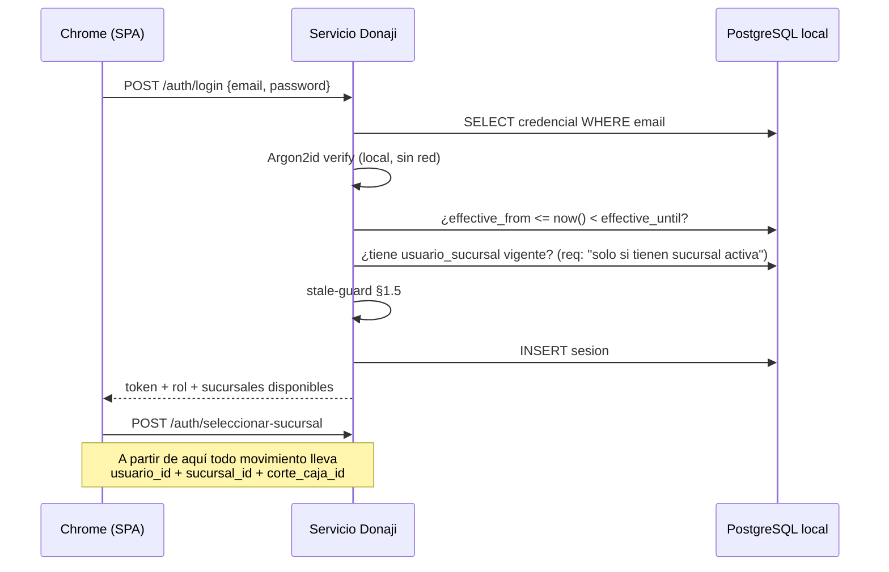
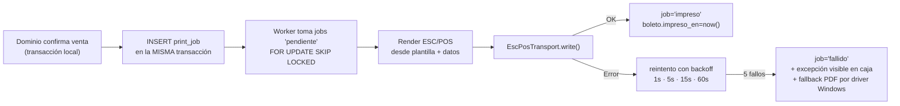

# 03 — Autenticación Offline, Impresión Térmica y Propagación de Configuración

> Blueprint v0.2. Incorpora los deltas D-4 (abstracción de transporte de impresión),
> D-5 (configuración del SO en el instalador) y D-8 (dos canales de propagación).

---

## 1. Autenticación y autorización sin red

### 1.1 Por qué Supabase Auth no sirve aquí

El requerimiento es explícito: *"durante una desconexión el sistema de autenticación debe
seguir funcionando contra la base de datos local"*.

Supabase Auth (GoTrue) valida credenciales contra un endpoint HTTP en la nube. Sin internet
no hay login, y ninguna configuración lo cambia. Cachear un JWT tampoco resuelve: expira, y
no permite que un usuario **que no ha iniciado sesión hoy** entre mañana durante un corte.

**Decisión: autenticación propia y local como IdP de la operación.** Supabase Auth se usa
solo para el dashboard del administrador en la nube, donde el internet es un prerrequisito
por definición.

### 1.2 Modelo

```sql
auth_local.credencial (
  usuario_id uuid PK,
  hash_password text NOT NULL,        -- Argon2id
  algoritmo text NOT NULL,            -- para rotación futura
  debe_cambiar boolean NOT NULL DEFAULT false,
  hash_actualizado_en timestamptz,
  effective_from timestamptz NOT NULL,-- alta diferida (ventana de madrugada)
  effective_until timestamptz         -- baja diferida
)

auth_local.sesion (
  id uuid PK, usuario_id uuid NOT NULL,
  sucursal_id uuid NOT NULL,          -- req: se elige sucursal al entrar
  caja_id text,
  emitida_en timestamptz, expira_en timestamptz,
  cerrada_en timestamptz, cerrada_motivo text
)

auth_local.intento (usuario_id, exito, ip, ocurrido_en)  -- rate limiting local
```

- El hash Argon2id se calcula **en la nube** al crear o cambiar la contraseña y se replica a
  los nodos como cualquier dato de clase A. El nodo nunca ve la contraseña en claro salvo
  en el instante del login, que valida localmente.
- La sesión es un token opaco (uuidv7) en `auth_local.sesion`, no un JWT: siendo todo local
  no hay ventaja en tokens autocontenidos y sí desventaja (no se pueden revocar). TTL 12 h
  o cierre de turno, lo que ocurra primero.
- Las sesiones **no se replican a la nube** (son ruido operativo); solo un resumen de login
  para auditoría.

### 1.3 Flujo de login (offline-safe)



Cero llamadas a la nube. Funciona igual con o sin internet.

### 1.4 Autorización

RBAC sobre los 3 roles del requerimiento, **con la matriz de permisos como dato replicado**
(`core.rol_permiso`), no como `if` en el código. Permite ajustar permisos sin desplegar —
lo cual importa especialmente bajo D-8, donde desplegar significa que un humano viaje por
TeamViewer a 4 terminales en una madrugada.

| Recurso | administrador | gerente | vendedor |
|---|---|---|---|
| Vender / reservar | ✔ | ✔ | ✔ (su sucursal) |
| Abrir / cerrar corte | ✔ | ✔ | ✔ (el suyo) |
| Ver movimientos inactivos | ✔ | ✖ | ✖ |
| Registrar egreso | ✔ | ✔ | ✔ |
| Anular boleto / egreso | ✔ | ✔ | ✖ |
| Configurar horarios, usuarios, tarifas | ✔ | ✖ | ✖ |
| Resolver excepciones de sobreventa | ✔ | ✔ | ✖ |
| Forzar asiento fuera de cupo (override) | ✔ | ✔ (auditado) | ✖ |
| **Cambiar conductor, caso incompatible** (02 §5.3) | ✔ | ✔ (auditado) | ✖ |
| Reimprimir ticket | ✔ | ✔ | ✔ (auditado) |
| Dashboard en nube | ✔ | ✖ | ✖ |

Toda acción se ejecuta **siempre** en el contexto `(usuario_id, sucursal_id,
corte_caja_id)`. La API rechaza cualquier escritura que implique dinero sin corte abierto.

En la nube se activa **RLS** sobre `core`: el nodo se autentica con un rol de servicio
limitado a `sync_sucursal_id = <su sucursal>` para escritura, con lectura amplia de
catálogos. Contiene el daño si una API key de un nodo se filtra — más relevante ahora que
la cuenta de Supabase es del proveedor y concentra los datos de las 4 sucursales (P6).

### 1.5 Revocación sin red — la tensión C4

**Problema real**: se despide a un vendedor un martes; la baja se programa en la nube; la
sucursal lleva 4 días sin internet; el vendedor sigue entrando y cobrando.

Tres capas de defensa, de menor a mayor fricción:

1. **Fecha efectiva como dato** (§3). Si el nodo sincronizó alguna vez después de la baja,
   la aplica localmente aunque luego pierda la red. Cubre el caso común.
2. **Stale-guard por antigüedad de sync** (SUPUESTO S9: 72 h). Si
   `now() − ultima_sync_exitosa > 72 h`, el nodo entra en **modo degradado**:
   - Se sigue vendiendo y cobrando (D1 es innegociable: la agencia no puede parar).
   - Banner permanente y no ocultable: *"Sin sincronizar desde {fecha}"*.
   - Se bloquea el **primer login** de cualquier usuario que no haya iniciado sesión en las
     últimas 24 h, salvo autorización presencial de un gerente. Un usuario ya en turno no se
     interrumpe.
   - Se prohíben overrides de asiento fuera de cupo y cambios de conductor del caso 2
     (el arbitraje sería a ciegas).
3. **Código de revocación fuera de banda** (F2, opcional). Cada sucursal tiene una semilla
   HOTP desde su alta. El administrador genera en el dashboard un código de 8 dígitos para
   `(sucursal, usuario, contador)` y **lo dicta por teléfono** al gerente, que lo captura.
   El nodo lo valida offline contra su semilla y desactiva al usuario de inmediato. Cubre
   exactamente el escenario del despido con la sucursal incomunicada.

---

## 2. Impresión térmica

**Hardware confirmado (P3/D-4)**: **Enduro 80 mm, USB y Ethernet**, con unidad física
disponible para pruebas. 80 mm → **48 columnas** fuente A. La impresora tiene **IP fija por
su propia configuración**, así que TCP:9100 es viable tal como estaba diseñado; USB queda
como alternativa porque la impresora está junto a la PC.

### 2.1 Abstracción de transporte (D-4)

```
       ┌─────────────────────────────────────────┐
       │  Renderer de plantillas (boleto,        │
       │  manifiesto, corte, etiqueta)           │
       └───────────────────┬─────────────────────┘
                           │  buffer ESC/POS (bytes)
       ┌───────────────────▼─────────────────────┐
       │  Capa ESC/POS: comandos, code page,     │
       │  QR nativo o raster, corte              │
       └───────────────────┬─────────────────────┘
                           │  interface EscPosTransport
              ┌────────────┴────────────┐
   ┌──────────▼──────────┐   ┌──────────▼──────────┐
   │   TcpTransport      │   │   UsbTransport      │
   │   net.Socket :9100  │   │   cola RAW Windows  │
   └─────────────────────┘   └─────────────────────┘
```

`EscPosTransport` expone `open()`, `write(bytes)`, `close()` y `probe()`. **La capa de
formato de ticket no sabe por dónde sale el papel.** Se implementan ambas desde F0, no una
"por si acaso": tener el fallback probado desde el principio es lo que convierte un
problema de campo en un cambio de configuración (`config_impresora.transporte`).

**Nota de implementación para `UsbTransport`**: en Windows, una térmica USB se expone como
cola de impresión, y enviar ESC/POS crudo requiere escribir con el datatype `RAW`. Es un
detalle que se resuelve en F0 con la unidad física, no una incógnita de diseño.

**Condición futura registrada**: hoy la IP de la PC puede ir por DHCP sin consecuencias
porque todo es `localhost` (D-1). En cuanto se agregue una segunda caja hará falta reserva
DHCP o un nombre de host estable para el nodo.

### 2.2 Camino de datos y idempotencia



**El `print_job` se crea dentro de la misma transacción que la venta.** Si la venta existe,
el job existe; si la transacción falla, no queda un job huérfano imprimiendo un boleto que
nunca se vendió.

**Idempotencia**: el worker marca `imprimiendo` antes de abrir el transporte. Si el proceso
muere después de imprimir pero antes de marcar `impreso`, un barrido pasa el job a
`revision_manual` en vez de reimprimirlo automáticamente. **Preferimos un ticket faltante
detectado a un ticket duplicado silencioso**, porque un duplicado en manos de un pasajero es
un asiento cobrado dos veces desde el mostrador.

**Un ticket por pasajero**: una venta de 5 boletos crea **5 `print_job`**, no uno con 5
cortes. Un fallo aísla un solo boleto y la reimpresión es granular.

### 2.3 ESC/POS y QR

- Comandos base: `ESC @` (init), `ESC a` (alineación), `GS !` (tamaño), `ESC E` (negritas),
  `GS V` (corte).
- **QR nativo**: `GS ( k` funciones 165/167/169/180. Estándar en impresoras ESC/POS
  modernas; **se verifica con la Enduro física en F0**.
- **Fallback**: generar el QR como matriz de bits en el nodo e imprimirlo con `GS v 0`
  (raster). ~1 s más lento pero funciona en cualquier impresora gráfica. Se selecciona por
  `config_impresora.soporta_qr_nativo`, no por prueba en caliente.
- Ancho: 80 mm confirmado → 48 columnas fuente A, 64 fuente B. El renderer toma
  `ancho_cols` de la configuración; ninguna plantilla asume el valor.
- Codificación: los nombres llevan acentos y `ñ`. Se selecciona code page con `ESC t`
  (`CP858` por defecto) y se transcodifica. **Probar en la unidad real en F0** — es la
  fuente #1 de tickets con caracteres basura.

### 2.4 Contenido del ticket y del QR

| Sección | Contenido |
|---|---|
| Header | Logo (raster), datos de la sucursal (nombre, dirección completa, teléfono principal), usuario que atiende, fecha/hora de atención, **folio** |
| Body | Nombre del pasajero, número de asiento, sucursal origen, sucursal destino, fecha y hora de viaje, número de unidad, importe |
| Footer | **QR con la información del ticket en texto plano**, leyenda personalizada, teléfonos de atención, credenciales del proveedor |

**Formato propuesto del texto del QR** (VACÍO V2). Texto plano, sin URL:

```
DONAJI|F:7K3M9A|P:JUAN PEREZ LOPEZ|A:12|O:CDMX|D:HUAJUAPAN
|FH:2026-03-14 07:00|U:ECO-142|IMP:450.00|V:9F2C1B8E
```

`V:` es un **HMAC-SHA256 truncado a 8 caracteres base32** sobre el resto del texto, con una
clave por agencia replicada a los nodos.

Justificación: el requerimiento pide texto plano y no URL, lo cual es correcto (no depende
de un servidor externo y funciona sin internet). Pero un QR de texto plano lo falsifica
cualquiera con un generador gratuito en 30 segundos. El HMAC permite que la terminal
destino **valide el boleto offline** escaneándolo, sin dejar de ser texto plano ni una URL.
**Propuesta a validar**: si el cliente lo rechaza, se omite el campo `V:` sin ningún otro
cambio en el diseño.

### 2.5 Manifiestos de abordaje

Dos jobs del mismo dato (`template_key='manifiesto'`, variante en `datos`):

| Copia | Diferencias |
|---|---|
| **Conductor** | Lista por parada de ascenso, sin importes, con teléfono de la terminal |
| **Terminal origen** | Casillas para palomear a mano, con importes y saldo pendiente, **boletos en conflicto en negritas**, resumen de ocupación por tramo |

El checklist es manual (lápiz) y luego se captura, tal como pide el requerimiento. El
manifiesto se imprime a T−20 min y lleva impresa la hora de generación, para que quede claro
que las ventas posteriores no aparecen en el papel.

---

## 3. Ventana de propagación de configuración

### 3.1 El principio

> **La configuración no se propaga como un comando remoto; se propaga como un dato con
> fecha de vigencia.**

Un "aplícate este cambio a las 3 a.m." requiere que la sucursal esté conectada a las 3 a.m.
y falla en silencio si no lo está. Un cambio con `effective_from` viaja como cualquier fila,
se guarda localmente aunque falten 5 días para su vigencia, y el nodo lo aplica solo con su
propio reloj. Si el nodo estuvo desconectado tres días y sincroniza el jueves un cambio con
`effective_from` del martes, lo aplica de inmediato al recibirlo — que es exactamente el
comportamiento deseado.

### 3.2 Mecánica

Toda entidad de clase A lleva `effective_from` (y `effective_until` para bajas):

```sql
CREATE VIEW core.v_horario_vigente AS
SELECT * FROM core.horario
WHERE activo AND effective_from <= now()
  AND (effective_until IS NULL OR effective_until > now());
```

Nadie lee las tablas base directamente; todo el sistema consume las vistas `v_*_vigente`.

El administrador elige el modo al guardar:

| Modo | `effective_from` | Uso |
|---|---|---|
| **Ventana nocturna** (default) | próxima ejecución (SUPUESTO: **03:00 hora local de la sucursal**) | Altas de horario, bajas de usuario, cambios de tarifa |
| **Inmediato** (requiere confirmación explícita) | `now()` | Emergencias: baja de usuario, cancelación de salida |
| **Programado** | fecha elegida | Tarifa de temporada, horario que arranca el día 1 |

### 3.3 El aplicador de configuración

Job en el nodo, cada 5 min y con una pasada dedicada en la ventana:

1. Materializa cambios con `effective_from` vencido: recalcula vistas, invalida caché en
   memoria, cierra sesiones de usuarios cuya vigencia terminó.
2. Aplica las salidas materializadas recibidas (horizonte 90 días).
3. Aplica el nuevo reparto de `cupo_offline`.
4. **Nunca** toca datos transaccionales ni interrumpe una venta en curso: un flujo de venta
   abierto termina con el snapshot que tomó al iniciar.

**Zona horaria**: cada sucursal tiene `zona_horaria` propia y la ventana se evalúa en hora
local. NTP activo queda garantizado por el instalador (D-5). Falta confirmar la zona
horaria de las 4 sucursales (P12, no bloqueante).

### 3.4 Qué se aplica en la ventana y qué no

| Cambio | Ventana | Inmediato | Razón |
|---|---|---|---|
| Alta de horario / ruta | ✔ | ✖ | Debe materializar salidas primero |
| Baja de horario | ✔ | ✖ | Puede haber boletos vendidos; requiere revisión |
| Alta de usuario | ✔ | ✔ opcional | Sin impacto en operación |
| Baja de usuario | ✔ | ✔ (recomendado) | Riesgo de seguridad; ver §1.5 |
| Cambio de tarifa | ✔ | ✖ | No cambiar el precio a media venta |
| Config de ticket / logo | ✔ | ✔ | Cosmético |
| IP o transporte de impresora | ✖ | ✔ | Corrección operativa urgente |
| Cancelar una salida específica | ✖ | ✔ | Es un hecho operativo, no configuración |
| Reparto de `cupo_offline` | ✔ | ✖ | Cambiarlo en caliente causaría conflictos |
| Cambio de conductor, caso 2 (02 §5.3) | ✖ | ✔ con conexión | Recalcula cupos; exige red |

---

## 4. Los dos canales de propagación (D-8)

Confirmado en P9: **solo TeamViewer**, en ventana de madrugada, **sin auto-actualización**.
Esto obliga a separar con claridad qué llega solo y qué llega a mano.

| Canal | Qué viaja | Cómo | Frecuencia | Si falla |
|---|---|---|---|---|
| **Datos** | Horarios, altas/bajas de usuario, tarifas, salidas materializadas, cupos, configuración de ticket | Automático, como filas con `effective_from` | Continua | Se reintenta solo; el stale-guard avisa |
| **Binarios** | Ejecutable del nodo y **migraciones de esquema** | Manual, TeamViewer, ventana de madrugada | Por release | La terminal se queda en N−1 y **sigue operando** (§01 §7) |

**La configuración nunca depende de que alguien entre por TeamViewer.** Solo el software lo
hace. Esta separación es lo que permite que una sucursal se salte una noche de
actualización por día no laboral sin que su operación se degrade.

### 4.1 Procedimiento de la ventana

1. **Nube primero**: se despliega la migración *expand* en Supabase (solo aditiva). La nube
   queda entendiendo N y N−1.
2. Por cada terminal, en la ventana acordada con el cliente:
   - Verificar que el respaldo local de la última hora existe (D-2). Si no, **no se
     actualiza**.
   - Detener el servicio, aplicar migración local, actualizar binario, arrancar.
   - Verificar: login, una venta de prueba, una impresión de prueba, un ciclo de sync.
   - Registrar la versión en el tablero de salud.
3. Terminales no alcanzadas esa noche quedan en N−1 y se atienden en la siguiente ventana.
4. La fase *contract* (renombrar/borrar) se programa **una release después**, solo cuando
   las 4 terminales reportaron la versión N.

El respaldo 4G/LTE se activa durante la ventana para que un corte de enlace no deje una
terminal a medio actualizar.

### 5. Configuración del sistema operativo (D-5)

El instalador deja la máquina en estas condiciones. Cada una responde a un modo de falla
concreto observado en el diseño:

| Ajuste | Modo de falla que previene |
|---|---|
| Servicio con arranque automático | Tras un corte de luz nadie en la terminal sabe iniciar el sistema |
| **NTP activo** | Deriva de reloj rompe la expiración de cupos ([01b §4](01b-consistencia-asientos.md)) — no es cosmético, es parte de la garantía anti-sobreventa |
| Plan de energía "nunca suspender" | La PC dormida detiene el sync y bloquea el acceso por TeamViewer en la ventana |
| Windows Update diferido a la ventana | Reinicio a media venta o a media impresión |
| Excepción de antivirus para el directorio de datos de PostgreSQL | Falsos positivos y bloqueo de archivos de la base |
| Regla de firewall local para el puerto del servicio | La SPA no llega al nodo tras una actualización de Windows |

**Ítem abierto menor**: Windows 10 vs 11 sin especificar. PostgreSQL 16 corre en ambos.
**Windows 10 está fuera de soporte** — nota de seguridad para el cliente.
