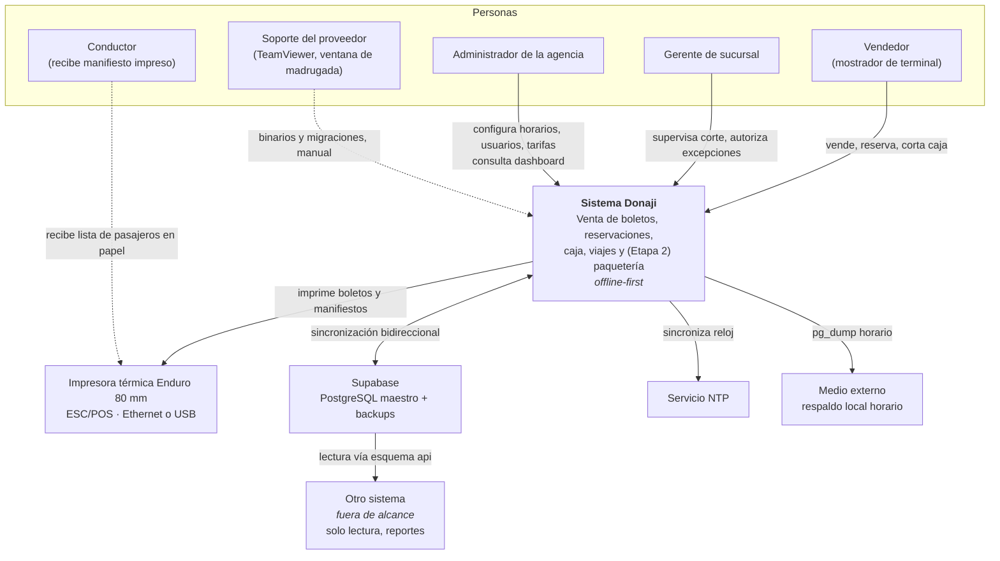
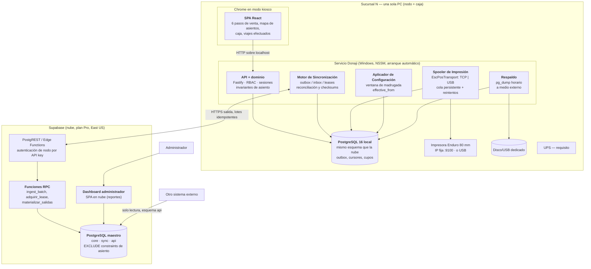
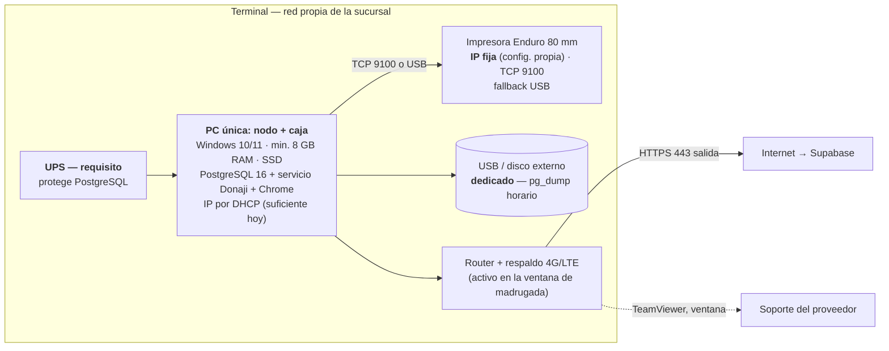

# Blueprint de Arquitectura — Donaji Travel Agency

> **Versión vigente: v0.2 — diseño en firme.** Preguntas bloqueantes cerradas.
> Cambios respecto de v0.1: ver [CHANGELOG.md](CHANGELOG.md).
> Etapa 1 (boletos, reservaciones, caja, viajes) con extensibilidad garantizada a
> Etapa 2 (paquetería entre sucursales).

---

## 1. Contexto y drivers arquitectónicos

### 1.1 Qué es el sistema

Sistema web **instalado localmente en cada terminal** de una agencia de transporte de
pasajeros con 4 sucursales (escalable a más), con una base de datos maestra en la nube
(Supabase / PostgreSQL) que además es consumida por un tercer sistema fuera de alcance.

**Escala confirmada (D-1)**: una sola PC por sucursal, que es simultáneamente el nodo y la
caja de venta. Unidades de 18 plazas × ~20 salidas/día ≈ **360 boletos/día** como cota
superior por sucursal. Sucursales activas 24/7 salvo días no laborales.

### 1.2 Drivers, ordenados por peso arquitectónico

| # | Driver | Origen | Implicación de diseño |
|---|---|---|---|
| D1 | **Operación sin internet** (venta y reservación) | Req. §Sincronización, "pieza no negociable" | Toda la ruta crítica de venta se ejecuta 100% local. La nube nunca está en el camino crítico de una venta. |
| D2 | **Consistencia de asientos entre sucursales** | Req. §Horarios: "los asientos de la sucursal origen también pueden ser vistos por la sucursal intermedia y no deben traslaparse" | El asiento es un recurso compartido bajo partición de red → particionamiento de capacidad + reconciliación determinista. Es el problema #1 del sistema. |
| D3 | **Auditabilidad y no-borrado** | Req. §Cortes de caja: activo/inactivo | Borrado lógico universal. Sin `DELETE` físico en el dominio. Alinea con D1: los tombstones de sync vienen gratis. |
| D4 | **Impresión térmica local** | Req. §Tickets: impresora Ethernet, un ticket por pasajero | El nodo debe hablar TCP crudo (o USB) a la impresora → el navegador solo no basta. Requiere proceso servidor local. |
| D5 | **Autenticación offline** | Req. §Sincronización | **Supabase Auth queda descartado como IdP de operación.** Auth propia con credenciales replicadas localmente. |
| D6 | **Propagación diferida de configuración** | Req. §Sincronización: cambios aplicados en madrugada | La configuración viaja como **datos con fecha efectiva**, no como comandos. Ver §03. |
| D7 | **Extensibilidad a paquetería** | Req. §Paquetería | Folios, movimientos de caja, impresión, manifiestos y eventos de custodia genéricos desde la Etapa 1. |
| D8 | **La nube es un contrato público** | Req. §Consideraciones técnicas | El esquema operativo no puede ser la interfaz. Se expone un esquema `api` de vistas versionadas. |
| D9 | **Actualización manual y desincronizada** *(nuevo en v0.2, D-8)* | P9: solo TeamViewer, sin auto-actualización | Nodos en versión N y N−1 conviven contra la misma nube **durante días**. Expand/contract estricto. |
| D10 | **Una sola máquina por sucursal** *(nuevo en v0.2, D-1)* | P1 | Cero sync intra-sucursal, pero SPOF total. Respaldo local y UPS pasan a requisito. |

### 1.3 Atributos de calidad objetivo

| Atributo | Objetivo | Cómo se verifica |
|---|---|---|
| Disponibilidad de venta local | 100% sin internet, indefinidamente (limitado por cupo offline y horizonte de salidas materializadas) | Prueba de caos: cortar red 72 h, seguir vendiendo |
| Sobreventa | **0 casos por diseño estando offline**; casos online resueltos deterministamente | Prueba de dos sucursales aisladas vendiendo el mismo asiento |
| Convergencia post-reconexión | 100% de escrituras locales presentes en nube; verificable por checksum | Job de reconciliación diario por bloques |
| Latencia de venta (paso 6 → ticket impreso) | < 3 s p95 | Benchmark en el hardware objetivo (8 GB / SSD) |
| Recuperación ante pérdida del disco | RPO ≤ 1 h (respaldo a medio externo) | Restauración desde dump en máquina limpia |
| Compatibilidad entre versiones | Nodo N−1 opera contra nube N durante ≥ 14 días | Prueba de convivencia en F9 |

---

## 2. Validación del requerimiento

### 2.1 Contradicciones detectadas

**C1 — La propuesta se contradice a sí misma sobre reservación entre sucursales.**
Lámina 6: *"Inventario autoritativo por viaje; la reserva entre sucursales se confirma en
línea"*. Lámina 7: *"La sucursal que hace la reserva **no requiere confirmación en línea**:
al reservar, el asiento queda apartado de inmediato"*.
Son mutuamente excluyentes, y lo prometido en la lámina 7 es **imposible** bajo partición
de red: si dos sucursales desconectadas apartan el mismo asiento, alguna pierde.
→ **Resolución**: se implementa una tercera vía que cumple la promesa comercial de forma
honesta y acotada — **cupo offline particionado por sucursal** (cada terminal tiene
asientos propios que aparta al instante sin red, con cero riesgo) + **lease en línea** para
asientos fuera de su cupo. Ver [01b-consistencia-asientos.md](01b-consistencia-asientos.md).

**C2 — Tres vehículos distintos en el mismo requerimiento.**
Paso 3: "Mercedes Benz Sprinter"; paso 2: "una suburban"; viajes efectuados: "la urvan".
→ **Resolución**: ningún layout se hardcodea. `tipo_unidad` con mapa declarativo en JSON.
**Cerrado en v0.2 (D-6/D-7)**: el parque es Sprinter de **18 plazas** (mapa real sembrado),
y el catálogo admite otros esquemas asociados al conductor y a la unidad.

**C3 — Cronograma de la propuesta vs. alcance del requerimiento.**
La propuesta estima ~4 meses para la Etapa 1; el roadmap técnico suma 21–27 semanas.
Ver [04-riesgos-roadmap.md](04-riesgos-roadmap.md) §3.

**C4 — Ventana de madrugada vs. operación offline prolongada.**
Si una sucursal lleva días sin internet, la baja de un usuario nunca llega.
→ **Resolución**: fecha efectiva + *stale-guard* + canal de revocación fuera de banda.
Ver [03-auth-impresion-config.md](03-auth-impresion-config.md) §1.5.

**C5 — Ingreso por reservación cobrada en destino vs. atribución del viaje.**
El pago de una reservación puede cobrarse en la terminal destino y suma al corte de **esa**
sucursal. Consecuencia: **la suma de los cortes de una sucursal ≠ la venta de los viajes
que salen de ella**. El requerimiento no distingue las dos métricas.
→ **Resolución**: se separan `sucursal_cobro`, `sucursal_venta` y `salida.sucursal_origen`.
Todo reporte declara cuál usa.

### 2.2 Ambigüedades resueltas por SUPUESTO

Huecos de negocio pendientes del cliente, resueltos con un default documentado y reversible
(todos viven en `core.parametro`, no en constantes de código).

| ID | Hueco | SUPUESTO adoptado |
|---|---|---|
| S1 | Cancelación de boleto / devoluciones (el req. lo declara "pendiente validar") | Cancelar = `activo=false` + movimiento de egreso por el monto devuelto. Sin reembolso parcial en Etapa 1. El asiento vuelve a su cupo de origen. |
| S2 | Quién gana una sobreventa | Prioridad determinista: (1) pagado e impreso, (2) pagado, (3) abono parcial, (4) sin pago; desempate por `emitido_en`, luego `sucursal_id`, luego `boleto_id`. **Nunca** por orden de llegada a la nube. |
| S3 | Qué se hace con el perdedor ya impreso | Reasignación automática conservando folio; si no hay asiento, cola de excepción y siguiente salida sin costo. |
| S4 | Cierre de venta antes de la salida | **T−15 min** de la hora de paso programada por esa parada. |
| S5 | Vigencia de una reservación sin pago | No expira sola (el req. dice baja manual). Pero el **cupo** sí: los asientos no vendidos de una sucursal intermedia vuelven al pool a **T−4 h**. |
| S6 | Horizonte de venta anticipada | Materialización de salidas a **90 días**. |
| S7 | Precio del boleto | Tarifa por par (origen, destino) vigente por fecha. El vendedor puede sobrescribir el importe con registro de auditoría. |
| S8 | Si un abono parcial permite abordar | No. `saldo_pendiente > 0` bloquea el abordaje salvo autorización de gerente, auditada. |
| S9 | Umbral de degradación por sync viejo | 72 h sin sincronizar. |
| S10 | Retención local | 18 meses en caliente en el nodo; la nube es el archivo histórico completo. |
| S11 *(v0.2)* | Teléfono de contacto en ventas | Se captura **un teléfono por venta** (no por pasajero) en todas las ventas, no solo en reservaciones. Sin él, la reasignación por conflicto (§01b) no es operable. |

### 2.3 Vacíos que no bloquean el diseño

- **V1 — CERRADO en v0.2 (D-6)**: el layout de la Sprinter está definido a partir de
  `knowledge/esquema.JPG`: 18 plazas, 1+2, banca trasera de 4.
- **V2** — Contenido exacto del texto del QR: formato propuesto en `03 §2.3`.
- **V3** — Contenido de las dos listas de pasajeros: propuesto en `03 §2.5`.
- **V4** — El campo `sueldo` no define periodicidad. **SUPUESTO**: es dato de reporte en la
  nube, **no** genera movimientos de caja automáticos.
- **V5** — "Credenciales del proveedor" en el pie del ticket: datos de contacto,
  configurables.

### 2.4 Riesgos de implementación detectados en la lectura

1. El requerimiento asume implícitamente que "Supabase" resuelve auth y sync. No hace
   ninguna de las dos para este caso (D1, D5). El grueso del esfuerzo es código propio.
2. El folio de **6 caracteres generado offline** colisiona si se genera aleatoriamente.
   Requiere particionamiento del espacio (`02b §1`).
3. El QR "solo texto plano, nunca URL" es falsificable con cualquier generador.
   Mitigación: HMAC truncado dentro del mismo texto plano.
4. El diseño depende de relojes sincronizados para la expiración de cupos.
   **Cerrado en v0.2 (D-5)**: NTP activo es parte del instalador.

---

## 3. Vista de contexto (C4 nivel 1)

**Dos canales separados hacia la sucursal** (D-8): los **datos** de configuración llegan
solos y continuamente; los **binarios y migraciones** llegan a mano por TeamViewer. La
operación nunca depende del segundo canal.

---

## 4. Vista de contenedores (C4 nivel 2)

### 4.1 Responsabilidad de cada contenedor

| Contenedor | Responsabilidad | Nunca hace |
|---|---|---|
| SPA | UI de los 6 pasos, mapa de asientos, cortes. Todo el estado viene de la API local. | Hablar con Supabase. Hablar con la impresora. |
| API local | Única autoridad de escritura del dominio. Valida invariantes contra la BD local. | Consultar la nube en el camino crítico de una venta. |
| Motor de sync | Empuja outbox, jala cambios, pide leases, reconcilia, calcula checksums. | Aplicar reglas de negocio propias. |
| Spooler | Formatea ESC/POS, gestiona cola, reintentos e idempotencia por job. | Decidir qué se imprime (lo decide el dominio). |
| Aplicador de config | Materializa cambios con `effective_from` vencido. | Aceptar comandos remotos ad-hoc. |
| Respaldo | `pg_dump` horario a medio externo, retención 7 días. | Escribir en el disco principal. |
| Postgres local | Fuente de verdad **operativa** de la sucursal. | Ser accedido desde otra sucursal. |
| Postgres nube | Fuente de verdad **consolidada** y árbitro de asientos compartidos. | Estar en el camino crítico de una venta offline. |

### 4.2 Por qué se conserva cliente-servidor sobre `localhost` (D-1)

Con una sola PC, la tentación obvia es colapsar todo en una app de escritorio monolítica
(Electron/Tauri con la base embebida). **Se descarta deliberadamente.** Razones, en orden
de peso:

1. **El servicio debe correr cuando nadie tiene la UI abierta.** La ventana de configuración
   de madrugada, el drenaje del outbox tras recuperar internet, el respaldo horario y la
   cola de impresión pendiente **ocurren sin operador**. Un proceso atado a una ventana se
   detiene cuando el vendedor cierra el programa al terminar su turno — y precisamente
   entonces es cuando el sistema tiene más trabajo que hacer. Este argumento por sí solo
   decide la cuestión, y **no depende de que algún día haya una segunda caja**.
2. **Agregar una caja debe ser configuración, no rediseño.** El usuario dijo "de momento".
   Con este diseño, la segunda caja es otro Chrome apuntando al nodo.
3. **Aislamiento de fallos.** Un cuelgue del navegador no interrumpe un lote de
   sincronización a la mitad.
4. **Diagnóstico remoto.** Un servicio con logs estructurados es depurable por TeamViewer;
   una ventana de Electron cerrada no.

El costo de esta decisión es prácticamente nulo: sobre `localhost` la latencia HTTP es de
microsegundos y no hay red que configurar.

**Condición futura registrada (D-4)**: hoy la IP de la PC puede ir por DHCP sin
consecuencias, porque todo es `localhost`. En cuanto se agregue una segunda caja hará falta
reserva DHCP o un nombre de host estable para el nodo.

---

## 5. Stack

**Decisión cerrada (P5): TypeScript end-to-end.** Revertible hasta F1, no después.

| Capa | Elección | Justificación |
|---|---|---|
| BD local | **PostgreSQL 16** (mismo motor que Supabase) | Migraciones idénticas local/nube sin traducción de dialecto. Necesitamos `EXCLUDE USING gist` con `int4range` para la invariante de asiento por tramo, columnas generadas, `jsonb` y transacciones serializables. SQLite no da nada de eso. |
| Backend | **Node 22 + TypeScript + Fastify** | Un solo lenguaje con el frontend. Sockets TCP crudos para ESC/POS. Se empaqueta como servicio de Windows con NSSM. |
| Acceso a datos | **Kysely** (SQL-first, migraciones versionadas) | El dominio es fuertemente SQL (constraints de exclusión, vistas, RPC). Un ORM que abstraiga SQL sería un pasivo. |
| Frontend | **React 18 + Vite + TanStack Query + Tailwind** | Mapa de asientos como grid/SVG desde el JSON de `tipo_unidad`; flujo de 6 pasos como máquina de estados. |
| Nube | **Supabase Pro**, East US: Postgres + PostgREST + Edge Functions + Storage | Impuesto por el requerimiento. Se usa Postgres a fondo (RPC en plpgsql), no solo como CRUD. Cuenta del proveedor (P6). |
| Auth operativa | **Propia**, Argon2id, sesiones locales | Supabase Auth no funciona sin internet (D5). |
| Auth del dashboard | Supabase Auth (solo administrador, solo nube) | Ahí sí hay internet por definición. |
| Impresión | Capa ESC/POS propia sobre `EscPosTransport` (TCP \| USB) | Control del comando `GS ( k` (QR), corte, cola e idempotencia. Ver `03 §2`. |
| Despliegue | **PostgreSQL 16 + servicio Windows vía NSSM, sin Docker** (P4) | Menos dependencias en un equipo de mostrador; el cliente da acceso de administrador. |
| Observabilidad | Logs estructurados locales + heartbeat a la nube + tablero de salud de sync | Diagnóstico remoto por TeamViewer para sucursales a 3–6 h. |

### 5.1 Alternativas evaluadas y descartadas

| Alternativa | Por qué se descarta |
|---|---|
| **SQLite local** | Sin `EXCLUDE` constraints ni tipos de rango; el invariante de asiento viviría en código de aplicación, perdiendo la garantía transaccional. Y obliga a mantener dos dialectos SQL. |
| **App de escritorio monolítica** (Electron/Tauri) | Ver §4.2. El servicio debe correr sin UI abierta. |
| **PWA offline-first en el navegador** | No puede abrir un socket TCP ni hablar USB con la impresora. |
| **PowerSync / ElectricSQL** | Resolverían bien el flujo config→sucursal, pero su modelo de conflictos es genérico (LWW). El problema de asientos **no** es resoluble con LWW: exige semántica de dominio. Se escribiría el motor propio igual, más una dependencia y un costo. |
| **.NET 8 + EF Core** | Técnicamente excelente en Windows. Descartado por unificación de lenguaje (P5) al no haber dominio previo declarado del equipo. Alternativa viva **solo hasta F1**. |
| **Nube como autoridad síncrona de asientos siempre** | Viola D1: sin internet no se vendería. Es lo que sugiere la lámina 6 de la propuesta. |
| **CRDT puro para asientos** | Los CRDT garantizan convergencia, **no** la invariante "un asiento, un pasajero". Convergerían a "dos boletos en el asiento 7". Se usan donde la invariante es monótona (pagos, abordajes), no para capacidad. |

---

## 6. Topología de despliegue

### 6.1 Por sucursal — una sola máquina

**Qué corre en la PC de la terminal**
- PostgreSQL 16 con el esquema completo del dominio (réplica funcional, no espejo).
- Servicio Donaji: API, motor de sync, spooler, aplicador de configuración, respaldo.
- Chrome en modo kiosco contra `http://localhost`.
- **Solo salida HTTPS**: sin IP pública, sin puertos abiertos hacia adentro.

**Requisitos de instalación, no recomendaciones**

| Requisito | Origen | Por qué |
|---|---|---|
| **UPS** | D-3 | PostgreSQL escribiendo durante un corte de luz puede corromper la base. Sin UPS no se instala. |
| **Medio externo dedicado para respaldo** | D-2 | Con una sola PC, es la única defensa contra perder la operación de la terminal. Nunca al mismo disco. |
| **NTP activo** | D-5 | La expiración de cupos de asientos depende de que los relojes no deriven. |
| **Plan de energía: nunca suspender** | D-5 | Si la PC se duerme se cae el sync y TeamViewer no entra en la ventana. |
| **Windows Update diferido a la ventana** | D-5 | Que no reinicie a media venta. |
| **Servicio con arranque automático** | D-5 | La terminal debe vender tras un corte de luz sin que nadie sepa iniciar nada. |
| Mínimo 8 GB RAM + SSD | D-1 | Postgres + servicio + Chrome en la misma máquina. |

**Ítem abierto menor**: no se especificó Windows 10 vs 11. PostgreSQL 16 corre en ambos.
**Windows 10 ya está fuera de soporte** — nota de seguridad para el cliente.

**Qué corre en la nube**
- Postgres maestro (`core` operativo + `api` público + `sync`).
- RPC de ingesta idempotente, adquisición de leases, materialización de salidas.
- Dashboard del administrador (reportes, auditoría de registros inactivos).
- Storage para logos y plantillas de ticket.
- Jobs programados: materialización, recálculo de cupos, reconciliación, **export completo
  periódico entregado al cliente** (mitigación del riesgo de continuidad, P6).

### 6.2 Alta de una sucursal nueva

1. El administrador da de alta la sucursal en la nube y obtiene su `codigo` de 1 carácter
   del alfabeto de folios más las credenciales de nodo.
2. Se instala el nodo con `sucursal_id` + API key; el instalador aplica los requisitos de §6.1.
3. Bootstrap: pull completo en orden topológico hasta alcanzar el cursor actual.
4. La sucursal entra al reparto de cupos en el siguiente ciclo de materialización.

Ningún paso toca las otras sucursales ni requiere redesplegar. Escalar de 4 a N es
configuración, no arquitectura — con el límite de **32 sucursales** que impone el alfabeto
de folios (ver [02b §1](02b-modelo-transaccional.md)), señalado explícitamente.

---

## 7. Continuación

- Motor de sincronización → [01-sincronizacion.md](01-sincronizacion.md)
- **Consistencia de asientos** → [01b-consistencia-asientos.md](01b-consistencia-asientos.md)
- Modelo de dominio (organización, flota, rutas) → [02-modelo-datos.md](02-modelo-datos.md)
- Modelo transaccional (ventas, caja, folios) → [02b-modelo-transaccional.md](02b-modelo-transaccional.md)
- Auth, impresión, configuración → [03-auth-impresion-config.md](03-auth-impresion-config.md)
- Riesgos, Etapa 2 y roadmap → [04-riesgos-roadmap.md](04-riesgos-roadmap.md)
- Preguntas técnicas → [preguntas-tecnicas.md](preguntas-tecnicas.md)
- Cambios v0.1 → v0.2 → [CHANGELOG.md](CHANGELOG.md)
